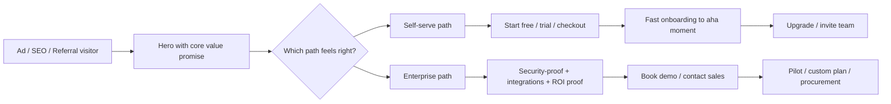
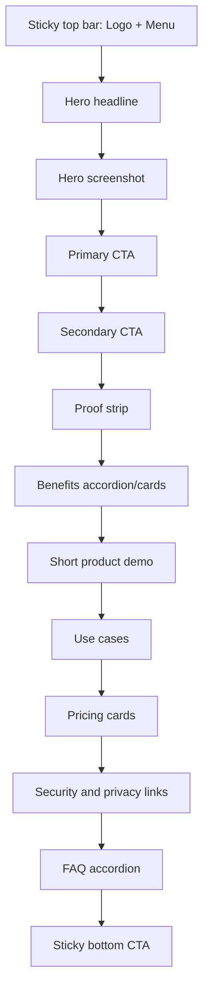

# Designing a High-Converting Landing Page for an Indie Software Product

## Executive Summary

For an indie software product that must win both individual users and enterprise teams, the highest-converting landing page is usually **not** a single-message page and **not** two completely separate websites. The most effective default is a **dual-path page**: one immediately obvious self-serve path for individuals and small teams, and one clearly available enterprise path for buyers who need demos, security validation, procurement support, or custom pricing. That recommendation follows from current B2B buying research showing that buyers want both self-service and human-assisted options, often within the same journey, while B2B sites still need to serve both end users and decision makers. citeturn6view3turn19view0turn22view0

The first screen matters disproportionately. Users still devote more attention to the top of the page than below the fold, they scan rather than read linearly, and they often decide within seconds whether the page is relevant. Above the fold, the page should therefore answer five questions fast: **what the product is, who it is for, what outcome it creates, why it is credible, and what to do next**. The hero should use informative imagery such as real screenshots or a concise product demo, not generic stock art or rotating carousels. citeturn0search0turn23view2turn13search4turn7search2turn7search5

Copy simplicity is a major lever. In Unbounce’s 2024 benchmark, SaaS landing pages written at a 5th–7th grade reading level converted far better than professional-level copy, and their SaaS-specific cut showed the same pattern even more strongly. That does **not** mean “dumb down” technical products; it means lead with plain-language outcomes, then let technical buyers drill into proof, specifications, integration details, and security. citeturn10view0turn26view0turn25view1turn13search1

Pricing should be as transparent as the business model allows. Even enterprise buyers want pricing context early, and hiding it can cause abandonment or shortlist exclusion. For a mixed audience, a practical pattern is to show a real self-serve price or entry price for individuals and smaller teams, then a clearly differentiated enterprise plan with “custom” pricing plus links to security, procurement, and compliance information. citeturn22view1turn22view0

Finally, conversion gains depend less on any one “best practice” than on instrumentation and disciplined testing. Measure the whole funnel, including micro-conversions such as demo-video plays, pricing views, security-page visits, and form starts. Then test message clarity, CTA friction, pricing presentation, social proof depth, and enterprise trust content with predeclared metrics, adequate sample size, and guardrails against false positives. citeturn8search2turn12search0turn8search0turn8search17

## Scope and Assumptions

Several critical variables were not specified: the product category, average contract value, current brand awareness, whether checkout is self-serve, whether an app account can be created instantly, whether enterprise features already exist, and the product’s compliance burden. Because those details materially change page design, the guidance below is intentionally framed as a **research-backed default architecture** for a new software product from an indie developer rather than a category-specific blueprint.

The most important implication of that ambiguity is this: the right landing page depends on whether the product behaves more like a low-friction PLG tool, a mid-market team product, or an enterprise purchase that requires stakeholder buy-in. B2B buyers often involve multiple stakeholders, need content for both “users” and “choosers,” and may evaluate integrations, pricing realism, and ROI over a longer decision window than consumers do. At the same time, modern B2B buyers still expect digital self-service and smooth omnichannel handoff when they do need a rep. citeturn22view0turn6view3turn19view0

A useful operating assumption for an indie developer is therefore:

| Commercial reality | Landing-page emphasis | Why |
|---|---|---|
| Low price, instant signup, short time-to-value | Primary CTA = **Start free** or **Try now** | Self-serve buyers prefer fast progress, and PLG benchmarks show freemium/trial flows can drive meaningful signup volume when onboarding is strong. citeturn6view1turn6view0 |
| Moderate team value, some coordination needed | Primary CTA = **Start free**; secondary CTA = **Book demo** | The page should support both rep-free evaluation and team-oriented validation. citeturn6view3turn19view0 |
| High ACV, security/procurement heavy, custom deployment | Primary CTA = **Book demo**; secondary CTA = **View pricing** or **See product** | Enterprise buying groups are larger, value framing and value affirmation matter, and hybrid digital-plus-human support improves deal quality. citeturn19view0turn20view0turn20view1turn20view2 |

## Audience Segmentation and Conversion Paths

The cleanest way to serve both audiences is to keep one core promise but tailor the **proof, friction, and next step**.

For **individual users**, the message should center on immediate personal gain: faster work, saved time, reduced frustration, lower cost, or better output. The dominant objections are usually “Is this for me?”, “How fast can I try it?”, and “What does it cost?” Self-serve visitors respond best when the page quickly demonstrates value, reduces signup friction, and signals an obvious path to activation. PLG benchmark data shows freemium products usually create more signups from the website than free-trial products, while free trials typically convert a higher percentage of signups to paid. OpenView’s benchmark also suggests activation rates in the 20–40% range are common, making time-to-value central to the page’s promise and the onboarding sequence that follows. citeturn6view1turn6view0

For **enterprise teams**, the same product promise must be translated into business outcomes, governance, and confidence. Gartner reports average enterprise B2B buying groups of five to eleven stakeholders, and both Gartner and NN/g emphasize the need to serve actual users and decision makers at the same time. Decision makers look for ROI, reliability, compatibility, support terms, and confidence cues; users want to know whether the product fits their workflow and will actually help them do their jobs. citeturn19view0turn22view0

That difference points to a two-track conversion model:

| Segment | Primary need | Dominant objection | Best primary CTA | Best supporting proof | Preferred friction level |
|---|---|---|---|---|---|
| Individual user | Fast value and low commitment | “This may be too much work to try.” | **Start free**, **Try it now**, **Use the template** | Product screenshot, short demo, outcome bullets, simple pricing | Very low: social or email signup, minimal fields, no unnecessary gating. citeturn6view1turn15view0turn16search0 |
| Small team lead | Team utility and collaboration | “Will this work for my team?” | **Start free for your team** | Collaboration proof, invite/team features, testimonials from team leads, plan comparison | Low-to-medium: optional account creation, clear team plan, maybe no credit card. citeturn6view1turn22view0 |
| Enterprise evaluator | Risk reduction and business fit | “Can I trust this vendor, and will procurement/security approve?” | **Book demo**, **Talk to sales**, **See enterprise options** | Security/compliance links, integration details, case studies, customer logos, realistic pricing context | Medium: shorter lead form, but more qualification justified. citeturn19view0turn22view0turn22view1turn4search0turn4search1 |

A practical landing-page pattern is to let the user self-select in the hero without forcing a hard segmentation page. For example, keep one main headline, then place two actions side by side: a filled **Start free** button and a lower-prominence **Book demo** or **For enterprise** path. This reflects McKinsey’s finding that across B2B journeys, buyers want a mix of in-person, remote, and digital self-serve options, and Gartner’s finding that hybrid digital-plus-human flows improve purchase quality. citeturn6view3turn19view0



The message architecture should also mirror Gartner’s distinction between **value framing** and **value affirmation**. Value framing helps buyers understand why the product matters; value affirmation helps them feel confident it is right for them. On a mixed-audience landing page, the hero, use-case section, and comparison copy do the framing; demos, prices, case studies, ratings, reviews, security links, and procurement materials do the affirmation. citeturn19view0turn20view1turn20view2

## Page Structure and Wireframes

A page that must convert both self-serve and enterprise traffic should not try to say everything at once. The best sequence is to reveal information in the order visitors usually need it: **relevance first, confidence second, detail third, conversion fourth**. NN/g’s homepage research, scrolling research, and eyetracking work all support putting the most important information high on the page and structuring the rest for scanning. Gartner’s B2B buying research then helps determine which proof modules belong near the top for enterprise confidence-building. citeturn23view2turn7search8turn9search9turn20view1

A strong default order is:

| Section order | Purpose | Why this belongs here |
|---|---|---|
| Minimal top nav | Orientation without leakage | Users need homepage-safe navigation and trust cues, but too many choices compete with the main action. citeturn23view1turn22view3 |
| Hero | Clarify value in one viewport | Users often decide quickly; most attention still concentrates near the top. citeturn13search4turn23view2turn0search0 |
| Proof strip | Reduce immediate skepticism | Early credibility improves continuance; social proof and recognizable trust cues help. citeturn22view3turn7search3turn27view0 |
| Product visual or short demo | Show the thing, not just tell | Informative imagery and product demos carry meaning better than decorative art. Gartner specifically calls out product demos and specification charts in B2B buying. citeturn7search2turn20view1 |
| Outcome-focused benefits and use cases | Translate product into jobs-to-be-done | Users scan headings and benefit language before reading detail. citeturn7search8turn13search1turn9search2 |
| How it works and integrations | Lower implementation anxiety | B2B sites must explain integrations, compatibility, and support both users and choosers. citeturn22view0 |
| Pricing block | Let buyers self-qualify | Price is a top information need, including in B2B. citeturn22view1turn22view0 |
| Enterprise trust block | Close the “can legal/security approve this?” gap | Security, privacy, DPA/SCC, and compliance cues help enterprise validation. citeturn4search0turn4search1turn4search3turn17search2 |
| FAQ | Resolve the last objections | Good for uncertainty, onboarding expectations, cancellation, security, and data handling. citeturn22view3turn3search1 |
| Final CTA | Capture late deciders | Long pages need a clean end-state CTA after objections are addressed. citeturn14search3turn23view1 |

### Desktop wireframe

```mermaid
flowchart TB
    A[Top bar: Logo | Pricing | Security | Docs | Sign in]
    B[Hero: H1 + subhead + primary CTA + secondary CTA + product screenshot/demo]
    C[Proof strip: logos / rating / user count / short trust cue]
    D[Benefits grid: 3-5 outcome cards]
    E[How it works: annotated screenshots or short video]
    F[Use cases by segment: Individual | Team | Enterprise]
    G[Integrations / compatibility / deployment notes]
    H[Pricing: Free | Pro | Team | Enterprise]
    I[Enterprise trust: Security, compliance, privacy, procurement]
    J[FAQ]
    K[Final CTA band]
    L[Footer]
    A --> B --> C --> D --> E --> F --> G --> H --> I --> J --> K --> L
```

### Mobile wireframe



### Recommended starting specs

The table below gives **starting points to test**, not universal laws. The rationale comes from research on fold/scroll behavior, scanning, mobile traffic share, readability, image usefulness, and accessibility requirements. citeturn23view2turn7search8turn26view0turn24search0turn2search0turn2search1

| Element | Recommended starting spec | Why this is a good default | Research basis |
|---|---|---|---|
| Hero height on desktop | ~70–85vh, with headline, CTA, and product visual all visible without requiring a full-screen takeover | Preserves above-the-fold relevance while still showing that more content exists below | Users dwell heavily at the top, and “false floors” suppress exploration. citeturn23view2turn0search0 |
| Hero height on mobile | ~55–75vh, avoiding oversized imagery that pushes CTA out of viewport | Mobile traffic dominates many SaaS pages, so CTA visibility matters more than visual drama | SaaS landing pages get substantial mobile traffic. citeturn26view0 |
| Hero content split on desktop | 50/50 or 55/45 text-to-visual | Balances fast comprehension with proof-through-visualization | Users scan first; informative imagery works better than decorative imagery. citeturn7search8turn7search2 |
| Product visual type | Real screenshot, annotated UI crop, or short demo thumbnail | Buyers need concrete evidence, not metaphorical art | Informative images outperform fluffy ones; Gartner highlights demos/spec charts in B2B journeys. citeturn7search6turn20view1 |
| Social-proof strip | 1 short row directly under hero | Quick credibility before deeper reading | Early trust cues reduce skepticism and help continuation. citeturn22view3turn7search3turn27view0 |
| Primary CTA repetition | 3–5 exposures on a long page: hero, after product proof, near pricing, near FAQ/final band | Repetition helps without forcing navigation back to top | Pages should prompt action at relevant points, while users scan sections selectively. citeturn23view1turn7search8 |
| Body text line length | 50–75 characters per line | Best readability range for body copy | Baymard large-scale testing. citeturn25view3 |
| Body copy density | For most SaaS pages, start around 250–725 words total on core conversion page | Enough depth for understanding without excessive reading load | Unbounce’s SaaS benchmark and NN/g web-writing findings. citeturn26view0turn9search12turn24search8 |
| Primary button height | Aim for ~44–56 px visual height; never below WCAG minimum touch target expectations in context | Improves tappability and visual salience | WCAG minimum target guidance is 24×24 CSS px; larger targets are easier to use. citeturn2search1 |
| Contrast for key text and CTAs | Meet or exceed 4.5:1 for normal text; 3:1 for large text and UI where allowed | Necessary for legibility and enterprise-grade polish | WCAG 2.2. citeturn2search0turn2search4 |
| Desktop layout grid | 12-column grid; 4-column grid or equivalent on mobile | Makes hierarchy and responsive adaptation clearer | NN/g grid guidance. citeturn28search4 |

## Visual Design, Mobile, Accessibility, and Performance

Visual hierarchy should make the intended next step obvious even when users skim. Eyetracking research shows people frequently scan in F-shaped or layer-cake patterns, meaning headings, first lines, emphasized phrases, and left-anchored elements get disproportionate attention. In practice that means the page should rely on clear headings, strong section labels, one dominant visual path, and restrained emphasis rather than decorative complexity. citeturn7search0turn7search8turn9search11

Typography should optimize for comprehension rather than brand theatrics. NN/g recommends a reasonably large default font size, high contrast, plain backgrounds, and clean typefaces, while Baymard’s large-scale work suggests a 50–75 character line length for body text. For landing pages, a practical default is to keep body text comfortably sized, make section headings informative and benefit-led, and give paragraphs enough breathing room that scanning remains easy. citeturn25view1turn25view3

Whitespace is most useful when it reinforces hierarchy rather than simply making the page look “premium.” The critical separation points are: between hero and proof strip; between CTA region and surrounding copy; between pricing cards; and around security/privacy/legal cues. Too little space makes sections blur together; too much space can push key content below the fold and create false-floor effects. That tradeoff is exactly why decorative, full-bleed hero sections regularly underperform more informative heroes. citeturn23view2turn13search11

For imagery, use the product whenever possible. NN/g’s imagery research and older usability work both converge on the same point: users pay attention to images that carry information and ignore fluffy visuals added merely to “jazz up” the page. So the best hero image for software is usually one of the following: a real interface screenshot, an annotated workflow sequence, a short embedded demo thumbnail, or a before/after result graphic. Generic stock photography should be used sparingly if at all, and auto-rotating carousels are usually worse than a strong static hero. citeturn7search2turn7search6turn7search5

Mobile deserves first-class treatment, not a compressed desktop afterthought. Unbounce’s SaaS benchmark found that 79% of SaaS landing-page visits in its data came from mobile, and its broader benchmark found that across industries, 83% of landing-page visits were mobile while desktop still converted somewhat better overall. That combination means the mobile experience is often where most demand first lands, even if desktop closes a larger share in some situations. On mobile, keep the headline short, preserve immediate screenshot visibility, avoid multi-column layouts, and keep one obvious CTA visible without requiring precision tapping. citeturn26view0turn11view3

Forms should be especially conservative on mobile. NN/g finds placeholder-only labels harmful, and Baymard’s field research shows multi-column forms create interpretation problems. For a new software product, that translates into one-column forms, visible labels, helpful hints outside the field, clear required-field logic, and precise, constructive error messages. citeturn1search3turn3search2turn3search0turn3search15

Accessibility should be handled as a conversion requirement, not a legal afterthought. WCAG 2.2 requires sufficient contrast, and its target-size guidance makes clear that larger targets help many users even beyond the minimum rules. Buttons must look and behave like buttons, links like links, and motion effects must be reducible when they can trigger discomfort. citeturn2search0turn2search1turn14search14turn23view1

Performance matters directly to conversion and perceived trust. Google’s mobile speed research found that pages loading one second faster can see substantial conversion improvements, and Google’s current Core Web Vitals targets remain LCP at 2.5 seconds or less, INP at 200 ms or less, and CLS at 0.1 or less at the 75th percentile of page loads. On a landing page, the hero often contains the largest content element, so hero media weight, font loading, server latency, and layout stability are not engineering details; they are conversion variables. citeturn0search6turn2search2turn21search2turn21search1turn21search8

## Copy, CTAs, Pricing, and Trust

The headline should function like an elevator pitch, not a slogan. NN/g’s homepage guidance is explicit that homepages should quickly and clearly convey what the organization does and what users can accomplish, while Unbounce’s benchmark shows that simpler, easier-to-read copy correlates with better landing-page conversion, especially in SaaS. A good headline therefore combines **who**, **outcome**, and **time/risk reduction** in plain language. citeturn23view0turn26view0turn10view0

Useful headline formulas for this context include:

| Formula | Best use case | Example |
|---|---|---|
| Outcome + audience + speed | Broad self-serve offer | **Finish client reports in half the time without changing your workflow** |
| Job-to-be-done + pain removed | Utility tool with obvious frustration | **Turn messy notes into clean action items automatically** |
| Category + differentiator + trust cue | New or unfamiliar product category | **The lightweight analytics workspace built for small teams and enterprise controls** |
| Team outcome + governance | Enterprise-oriented page or section | **Give every team a faster workflow with the security your admins require** |

Subheads should do the heavier explanatory work. A strong subhead typically names the mechanism, the proof, or the reduction in risk: “Set up in 5 minutes. No credit card required. SOC 2 report available for enterprise review.” That style aligns with NN/g’s user-centric writing guidance and its recommendation to focus on benefits instead of jargon or maker-centric language. citeturn13search1turn25view1

Feature copy should usually follow a **benefit → mechanism → proof** sequence. Start with what changes for the user, then explain how the product does it, then support the claim with a screenshot, metric, testimonial, integration detail, or case example. The reason is simple: readers scan benefits first, but enterprise stakeholders later need substantiation. Gartner’s value-framing/value-affirmation model maps almost exactly to this sequencing. citeturn20view1turn20view2

CTA wording should be specific enough that users can predict what happens next. Generic text such as “Get started” often wins clicks because it is familiar, but NN/g has noted that such labels can also mislead users when the next step is ambiguous. Better CTA text names the action and the expected value: **Start free**, **Book a demo**, **See pricing**, **Watch the 2-minute demo**, **Try the template**, **Talk to sales**, **Compare plans**. citeturn14search2turn14search14

A mixed-audience landing page should usually have **one primary CTA style** and **one secondary CTA style**. The primary CTA should be the only filled, highest-contrast action in a given region; secondary actions should be outlined or text links. The primary CTA should appear above the fold and then repeat after major proof sections. If the page is primarily self-serve, the primary CTA should remain self-serve throughout, with demo/contact actions clearly available but visually secondary. If the product is enterprise-led, reverse that emphasis. This follows both action-prompting principles and the need to visually distinguish primary from secondary paths. citeturn23view1turn14search18

The CTA color should be chosen for **contrast and consistency**, not because one hue “always converts.” Research and accessibility guidance support salience and legibility, but there is no credible universal best CTA color independent of page context. A good rule is to reserve one accent color almost exclusively for the primary CTA, maintain accessible contrast, and avoid using that same treatment for non-conversion elements. citeturn2search0turn14search3

Pricing presentation should vary by monetization model:

| Model | Recommended presentation | Why |
|---|---|---|
| Freemium | Show free tier first, clearly state limits, and show the next paid tier inline | PLG benchmarks show freemium often increases signup rate, but visitors still need to understand what “free” actually means. citeturn6view1 |
| Time-boxed free trial | Show trial duration prominently, clarify card requirement, and show what happens after the trial | ChartMogul’s 2026 report found 57% of products used a free trial as the primary entry point, with 14 days the most common duration. citeturn6view0 |
| Credit-card trial | Use only if you can tolerate lower signup volume and want higher-intent users | Card-required trials converted to paid at much higher rates in ChartMogul’s dataset, but this typically trades off against top-of-funnel volume and should be tested rather than assumed. citeturn6view0turn6view1 |
| Reverse trial | Give full-featured access first, then downgrade to a free plan | OpenView notes reverse trials as a way to blend strong early conversion with a long tail of freemium conversion. citeturn6view1 |
| Enterprise | Show “Custom” or “Talk to sales,” but still provide enough price context to self-qualify | B2B buyers still want pricing information early, even if exact quotes vary. citeturn22view1turn22view0 |

For lead capture versus direct purchase, the governing rule is simple: **gate only what must be gated**. NN/g warns that people detest unnecessary lead-generation forms, especially when the questions feel irrelevant or nosy. VWO’s Kommunicate case study is a useful illustration: removing an email field from a CTA module increased clicks on the free-trial CTA by 25.53%. For self-serve products, direct signup, checkout, or interactive demo access should usually beat a generic lead form. Reserve forms for enterprise demos, custom quotes, security reviews, or high-intent assets. citeturn16search0turn15view0

Trust signals should be layered, not dumped. The strongest stack usually combines: recognizable customer logos, a rating or review summary, one or two specific testimonials tied to concrete outcomes, product screenshots, pricing transparency, and enterprise trust links such as Security, Privacy, DPA, SCCs, and Terms. Reviews matter especially when stakes are higher: Spiegel’s research found that the first few reviews drive the largest conversion lift, and that reviews produce greater conversion gains for higher-priced products. NN/g also warns that weak social proof can backfire, so avoid showcasing tiny counts or vanity metrics that make the product look unpopular. citeturn27view0turn7search3turn22view3

For enterprise trust, compliance and privacy cues should be visible before the form submit, not hidden in the footer alone. If you collect personal data, GDPR Article 12 and ICO guidance both require concise, transparent, intelligible, easily accessible privacy information in clear language. If you mention international transfers, SCCs matter; if you claim security program maturity, links to verified SOC reporting or ISO 27001 certification context are strong enterprise cues. Put this material one click away from the pricing or demo CTA, and summarize it in human language near the form. citeturn17search3turn17search2turn4search3turn4search0turn4search1

A useful CTA and demo sequence for this mixed audience is:

| Visitor type | Best sequence |
|---|---|
| Individual | Hero screenshot → short proof strip → **Start free** → onboarding to first win |
| Small team | Hero screenshot → collaboration/team benefits → pricing → **Start free for your team** |
| Enterprise | Hero screenshot or 90-second demo → logos/case proof → integrations/security summary → **Book demo** |

That sequence mirrors Gartner’s finding that websites should carry both value-framing and value-affirming content, including demos, spec charts, calculators, and ratings/reviews across the buying journey. citeturn20view1turn20view2

## Measurement and Experimentation

The landing page should be managed as a measurable funnel, not a static asset. At minimum, track these stages: landing-page view, engaged view, hero CTA click, pricing view, demo play, form start, form completion, signup, activation milestone, and paid conversion or qualified pipeline creation. Google Analytics’ event model and funnel reporting support this kind of instrumentation, and recommended event conventions such as `sign_up`, `generate_lead`, and `purchase` help standardize reporting. citeturn12search1turn12search0turn8search2turn8search6

A practical event model for this page looks like this:

| Funnel stage | Example event | What it tells you |
|---|---|---|
| Entry | `page_view_lp` | Volume by source, device, campaign |
| Attention | `scroll_50`, `hero_visible_3s`, `demo_play` | Whether the hero is holding attention |
| Intent | `cta_primary_click`, `pricing_view`, `security_view`, `faq_expand` | Which objections or buying modes dominate |
| Form friction | `form_start`, `field_error`, `form_submit` | Where demo/lead friction occurs |
| Outcome | `sign_up`, `generate_lead`, `purchase` | Primary conversions |
| Post-click quality | `activation_complete`, `workspace_created`, `invite_sent` | Whether the page is attracting the right users |

When you review performance, split by **new vs returning**, **device**, **channel**, and **self-serve vs demo path**. Unbounce’s benchmark shows big traffic and conversion differences by device and channel in SaaS, and enterprise-oriented sources are often particularly sensitive to email, direct, and branded traffic. citeturn26view0

You should also define micro-conversions explicitly. For this kind of product, the most useful micro-conversions are not superficial engagement metrics; they are moments that reveal buying intent or qualification, such as:

- viewing pricing,
- opening the security/compliance area,
- starting the signup form,
- clicking into integrations,
- watching at least 50% of the demo,
- inviting a teammate after signup,
- reaching the first activation milestone.

Those last post-click behaviors are especially important because landing pages that maximize raw signup count can still underperform if they attract low-quality or poorly activated users. OpenView’s new-user journey emphasizes activation and time-to-value as essential bridge stages between acquisition and revenue. citeturn6view1

For statistical rigor, set the test design before launch. A sensible default is **95% confidence, 80% power, and a predetermined minimum detectable effect** aligned to business value. VWO’s sample-size guidance and Optimizely’s Stats Engine documentation both emphasize that sample size depends on the baseline conversion rate, expected lift, and test configuration. If you use traditional fixed-horizon testing, do not repeatedly peek and stop early; if you use a sequential engine, use one designed to control false positives and false discovery rate. citeturn8search17turn8search1turn8search0turn8search16

A practical operating rule is to run each test through at least one full business cycle, usually a minimum of one to two weeks, longer if traffic is source-dependent or weekday behavior differs from weekend behavior. That is not a law of statistics; it is an operational safeguard to avoid shipping noise caused by abnormal daily traffic patterns. citeturn8search3turn8search11

### Ten specific A/B tests

| Test | Hypothesis | Primary metric | Guardrail | Success criterion | Research basis |
|---|---|---|---|---|---|
| Hero headline outcome-first vs feature-first | Outcome-led copy will increase qualified action because users scan for relevance before detail | Primary CTA click-through rate | Bounce rate, pricing-view rate | Winner lifts CTA CTR and does not reduce downstream signup/demo quality | Users scan and prefer user-centric, benefit-led language. citeturn9search9turn13search1 |
| Real screenshot vs abstract illustration in hero | Product-real visuals will outperform decorative art by reducing ambiguity | Hero CTA CTR | Demo-play rate | Screenshot variant improves CTR and/or engaged-view rate | Informative imagery outperforms fluffy images. citeturn7search2turn7search6 |
| Static hero vs carousel | Static hero will increase clarity and reduce missed attention | Hero CTR | Scroll depth | Static hero wins on CTR and section engagement | Users often skip or ignore carousels. citeturn7search5 |
| Self-serve primary CTA vs demo primary CTA | For lower-friction traffic, self-serve CTA will increase total qualified conversions; for enterprise-heavy traffic, demo CTA may improve pipeline quality | `sign_up` or `generate_lead` by variant | Activation rate / sales-accepted lead rate | Choose winner by revenue-adjusted conversion, not click volume alone | Buyers want mixed digital and human options; hybrid quality effects matter. citeturn6view3turn19view0 |
| One-field CTA module vs multi-field hero form | Reducing initial friction will increase hero progression | CTA click or form completion | Signup quality, spam rate | Simpler variation improves start-to-submit rate without harming quality | Long or intrusive forms repel users; removing fields can lift clicks. citeturn16search0turn15view0 |
| Pricing visible on page vs “Contact us for pricing” | Showing at least representative pricing will increase qualified next steps and reduce abandonment | Pricing-section CTR to conversion | Average deal size / lead quality | Visible pricing increases qualified conversions or shortlist behavior | Buyers want price context, including in B2B. citeturn22view1turn22view0 |
| Review/testimonial placement above vs below pricing | Early social proof may reduce hesitation before price exposure | Pricing-to-conversion rate | Overall CTR | Earlier placement improves progression through pricing | Reviews affect conversion and matter more for higher-stakes purchases. citeturn27view0 |
| Reading-grade simplification | Lower-complexity copy will improve conversion | CTA CTR or form completion | Lead quality | Simpler copy improves conversions without harming enterprise lead rate | Unbounce benchmark. citeturn10view0turn26view0 |
| Credit-card trial vs no-card trial | Card-required trial may reduce signup rate but improve free-to-paid conversion | Free-to-paid conversion | Trial signup rate | Choose based on total paid users or revenue, not trial volume alone | ChartMogul 2026 trial benchmark. citeturn6view0 |
| Enterprise trust block near CTA vs lower page | Moving security/privacy/compliance cues closer to the demo CTA will increase enterprise lead completion | Demo form completion rate | Self-serve CTR | Trust-near-CTA variant improves enterprise conversion | Up-front disclosure, trustworthiness, and security reassurance matter near commitment points. citeturn22view3turn3search3turn17search2 |

## Required Checklist and Example Copy

### Required checklist

| Category | Required trait | Minimum implementation standard | Why it matters |
|---|---|---|---|
| Messaging | Clear value proposition in first viewport | H1 + subhead explain what the product does, for whom, and why it is different | Users decide relevance quickly and still focus disproportionately at the top. citeturn13search4turn23view2 |
| Segmentation | Dual-path conversion | Self-serve CTA plus enterprise CTA present without forcing a full segmentation page | Buyers want self-service and human paths. citeturn6view3turn19view0 |
| Imagery | Real product proof | Screenshot, annotated UI, or short demo near hero | Informative imagery beats decorative imagery. citeturn7search2turn7search6 |
| Social proof | Early credibility | Logos, rating/review summary, or quantified testimonial under hero | Trust and social proof reduce skepticism. citeturn22view3turn27view0 |
| CTA hierarchy | One dominant action style | One filled primary CTA style; one lower-prominence secondary style | Distinguishes main path from auxiliary paths. citeturn14search18turn23view1 |
| Copy quality | Plain language | Avoid jargon-loaded or feature-only blurbs; keep copy scannable | Simpler copy converts better and improves usability. citeturn10view0turn26view0turn9search9 |
| Pricing | Transparent self-qualification | Show real or representative price context, including enterprise positioning | Hidden pricing frustrates B2B buyers. citeturn22view1 |
| Forms | Low-friction input | One-column layout, visible labels, constructive errors, minimal fields | Better completion and lower confusion. citeturn1search3turn3search2turn3search0 |
| Mobile | Mobile-first execution | No broken desktop shrink-down; CTA visible early; responsive grid | Mobile is a major share of SaaS landing-page traffic. citeturn26view0 |
| Accessibility | Contrast and target size | Meet WCAG contrast; avoid tiny tap targets | Conversion and accessibility are aligned here. citeturn2search0turn2search1 |
| Performance | Core Web Vitals discipline | LCP ≤ 2.5s, INP ≤ 200ms, CLS ≤ 0.1 at p75 | Slow or unstable pages cost conversions. citeturn2search2turn21search2turn21search1 |
| Enterprise trust | Visible legal/security cues | Security page, privacy notice, terms, DPA/SCC, verified compliance claims | Enterprise buyers need value affirmation and transparent data handling. citeturn20view1turn17search3turn17search2turn4search3turn4search0turn4search1 |
| Analytics | Full-funnel event tracking | Track landing → intent → form → signup → activation → paid | Otherwise you optimize clicks instead of business outcomes. citeturn12search1turn8search2turn6view1 |
| Experimentation | Predefined test discipline | Hypothesis, metric, guardrail, sample size, stop rule | Prevents misleading wins and p-hacking. citeturn8search0turn8search17 |

### Example copy snippets

Because the product category is unspecified, the snippets below are intentionally generic and should be adapted to the product’s actual job-to-be-done.

**Headline options**

- **Do your most repetitive work in minutes, not hours.**
- **The fastest way for small teams to turn messy work into clean output.**
- **All the speed individual users want, with the controls enterprise teams need.**
- **Start free today. Roll out securely when your team is ready.**

**Subhead options**

- **Automate the workflow that slows you down, then hand it off to your team with approvals, permissions, and audit-ready controls.**
- **Set up in minutes, learn it in one session, and keep your existing workflow intact.**
- **Use it yourself in five minutes or book a demo for security, procurement, and rollout planning.**

**Primary CTA options**

- **Start free**
- **Try it now**
- **Create my workspace**
- **Start free for your team**

**Secondary CTA options**

- **Book a demo**
- **See pricing**
- **Watch the 90-second demo**
- **View enterprise options**

**Trust microcopy near CTA**

- **No credit card required**
- **Cancel anytime**
- **SOC 2 documentation available for qualified buyers**
- **Privacy-first. Clear terms. No surprise charges**
- **Works with the tools your team already uses**

**Social-proof snippets**

- **“We replaced three manual steps with one workflow and cut turnaround time by 62%.”**
- **Trusted by solo consultants, fast-moving startups, and security-conscious teams**
- **Rated 4.8/5 by early users**
- **From first task to team rollout without changing our existing process**

**Pricing copy snippets**

- **Free for personal use. Upgrade when you need collaboration and advanced controls**
- **Pro for power users. Team for shared workflows. Enterprise for SSO, governance, and procurement support**
- **Talk to sales for volume pricing, security review, and rollout planning**

**Enterprise reassurance snippets**

- **Need security or legal review? We provide privacy, DPA, and transfer documentation**
- **Built for self-serve adoption, ready for enterprise governance**
- **See integrations, deployment details, and security answers before you book time**

If I had to compress the entire report into one practical instruction, it would be this: **make the first screen unbelievably clear, make the next screenfuls unbelievably credible, and make the next step unbelievably easy**. The research consistently points in that direction, even if the exact wording, visual treatment, and pricing presentation should still be validated on your own traffic. citeturn23view0turn23view2turn22view3turn8search0turn8search17